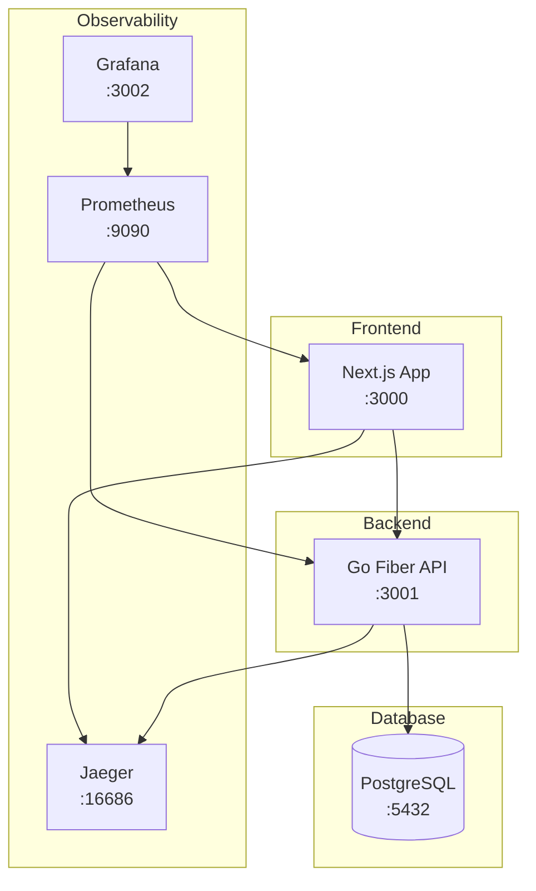

# 📚 Book Management System

<div align="center">
  
  
  
  
  
</div>

<div align="center">
  <strong>A modern, scalable book management system with observability and testing</strong>
</div>

## 📖 Table of Contents

- [Features](#-features)
- [Quick Start](#-quick-start)
- [Architecture](#-architecture)
- [Tech Stack](#-tech-stack)
- [Project Structure](#-project-structure)
- [Development](#-development)
- [Testing](#-testing)
- [Observability](#-observability)
- [Deployment](#-deployment)
- [License](#-license)

## ✨ Features

- **📚 Book Management**: Create, read, update, and delete books with rich metadata
- **🔍 Advanced Search**: Search and filter books by title, author, and publication year
- **📄 Pagination**: Efficient pagination for large book collections
- **🎨 Modern UI**: Responsive web interface built with Next.js and HeroUI
- **📊 Observability**: Comprehensive monitoring with Prometheus, Grafana, and Jaeger
- **🧪 Testing**: Unit, integration, E2E, and contract testing
- **🐳 Containerized**: Fully dockerized for easy deployment
- **⚡ Performance**: Optimized with caching and efficient database queries

## 🚀 Quick Start

### Prerequisites

- Docker and Docker Compose
- Node.js 18+ (for local development)
- Go 1.24+ (for local development)
- Bun (for web development)

### Installation

1. **Clone the repository**
```bash
git clone https://github.com/yourusername/byfood-case-study.git
cd byfood-case-study
```

2. **Start the application with Docker Compose**
```bash
docker-compose up -d
```

3. **Access the services**
- 🌐 Web Application: http://localhost:3000
- 🔧 API Server: http://localhost:3001
- 📊 Grafana: http://localhost:3002 (admin/admin)
- 🔍 Jaeger UI: http://localhost:16686
- 📈 Prometheus: http://localhost:9090

## 🏗 Architecture

### System Overview



### Components

- **Web Frontend**: Server-side rendered Next.js application with React
- **API Backend**: High-performance Go API using Fiber framework
- **Database**: PostgreSQL for persistent data storage
- **Monitoring**: Prometheus for metrics collection
- **Visualization**: Grafana for metrics dashboards
- **Tracing**: Jaeger for distributed tracing

## 🛠 Tech Stack

### Backend (API)
- **Language**: Go 1.24
- **Framework**: Fiber v2
- **Database**: PostgreSQL with pgx driver
- **Validation**: go-playground/validator
- **Testing**: Testify, Mock
- **Observability**: OpenTelemetry, Prometheus

### Frontend (Web)
- **Framework**: Next.js 15 with TypeScript
- **UI Library**: HeroUI (Hero Design System)
- **Styling**: Tailwind CSS
- **State Management**: React Context API
- **Forms**: React Hook Form with Zod validation
- **HTTP Client**: Ky
- **Testing**: Cypress, Pact

### Infrastructure
- **Containerization**: Docker
- **Orchestration**: Docker Compose
- **Monitoring**: Prometheus + Grafana
- **Tracing**: Jaeger
- **Database**: PostgreSQL

## 📁 Project Structure

```
.
├── api/                    # Go API service
│   ├── internal/          # Internal packages
│   │   └── book/         # Book domain logic
│   ├── pkg/              # Shared packages
│   ├── migrations/       # Database migrations
│   └── config/          # Configuration files
├── web/                   # Next.js web application
│   ├── app/              # Next.js app directory
│   ├── components/       # React components
│   ├── clients/          # API clients
│   ├── dto/              # Data transfer objects
│   ├── cypress/          # E2E tests
│   └── tests/            # Unit and contract tests
├── .deploy/              # Deployment configurations
│   ├── prometheus/       # Prometheus config
│   └── grafana/          # Grafana dashboards
└── docker-compose.yml    # Docker compose configuration
```

## 💻 Development

### Local Development Setup

#### Backend (API)
```bash
cd api
go mod install
go run main.go
```

#### Frontend (Web)
```bash
cd web
bun install
bun run dev
```

### Environment Variables

#### API Configuration
- Database connection via `config/config.json`
- OpenTelemetry endpoint configuration

#### Web Configuration
- `NEXT_PUBLIC_API_URL`: API server URL
- `OTEL_EXPORTER_OTLP_ENDPOINT`: Jaeger endpoint

## 🧪 Testing

### Running Tests

#### Unit Tests (API)
```bash
cd api
go test ./...
```

#### Unit Tests (Web)
```bash
cd web
bun test
```

#### Acceptance Tests
```bash
cd web
bun run test:acceptance:chrome
```

#### Contract Tests
```bash
cd web
bun run test:pact
```

### Test Coverage
- Unit tests for business logic
- Integration tests for API endpoints
- E2E tests with Cypress and Cucumber
- Contract tests with Pact

## 📊 Observability

### Metrics
Access Prometheus metrics at http://localhost:9090
- Request rates and latencies
- Error rates
- Database connection pool metrics
- Custom business metrics

### Dashboards
Access Grafana at http://localhost:3002 (admin/admin)
- Application performance dashboard
- Database performance dashboard
- Business metrics dashboard

### Tracing
Access Jaeger UI at http://localhost:16686
- Distributed request tracing
- Performance bottleneck identification
- Error investigation

## 🚢 Deployment

### Docker Deployment

Build and run with Docker Compose:
```bash
docker-compose up --build
```

### Production Considerations

- Use environment-specific configurations
- Enable TLS/SSL for all services
- Configure proper database backups
- Set up monitoring alerts
- Implement rate limiting
- Configure proper logging

### Development Guidelines

- Write tests for new features
- Update documentation
- Follow existing code style
- Add OpenTelemetry instrumentation
- Ensure all tests pass

## 📄 License

This project is licensed under the MIT License - see the [LICENSE](LICENSE) file for details.
